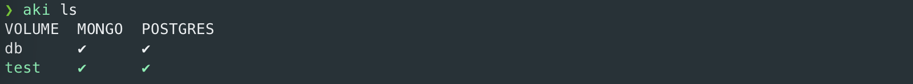
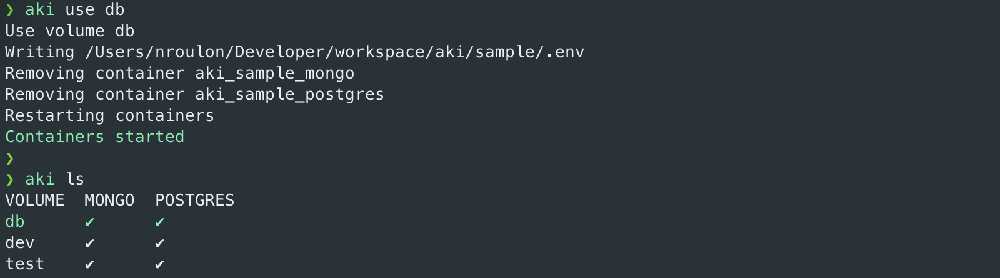
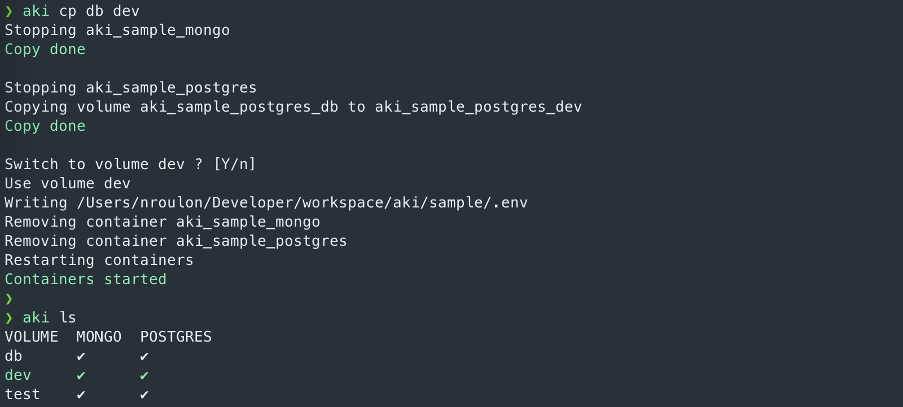
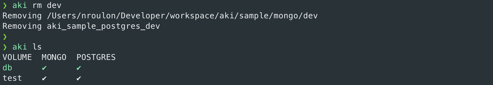

# AKI
## Description
You have switched to a branch and your app is now down because your database has data of another branch ? If your project
use docker compose, aki can help you by managing volume and mount the correct volume on your container.

Aki can list, switch, copy and remove all volume link to your project. Aki is a simple script that manage volumes by
modifying docker compose variable for switch volume.

## Installation
### Docker
An image `ghcr.io/4sh/aki:latest` is available.

The only requirement is access to your docker daemon, for that you need to mount `/var/run/docker.sock` in the
container. You also need to mount the docker-compose folder with the same path as your system,
e.g. if `docker-compose.yaml` is in `/project/docker-compose.yaml` then it must be `/project/docker-compose.yaml` in
the container.

```
docker run --rm --interactive \
    --volume /var/run/docker.sock:/var/run/docker.sock \
    --volume /path/to/aki:/path/to/aki ghcr.io/4sh/aki:latest
```

### Python
A python package is also available, aki is compatible and tested with Python 3.8, 3.9, 3.10, 3.11 and 3.12.

You can install aki with [pipx](https://pipx.pypa.io/):
```
pipx install https://github.com/4sh/aki/releases/download/v0.10.4/aki-0.10.4.tar.gz
```

### Docker or Python ?
If you are (and your coworkers) on Linux you can use either the docker or the python version. The docker version can be
better as you do not have to care about python in your system, plus you can enforce `aki` version by specify precisely
the image you want for you and your coworkers.

On macOS, it can be a little more difficult due to how docker function.

#### The project use "in docker" volume
You can use either the docker or the python version but **be careful of docker VM disk space**. You can check it in
Docker Desktop > Settings > Resources > Disk image size.

#### The project use mount folder
Docker have poor IO performances for mounted volumes on macOS so command like "aki cp" will be really slow with the
docker version. The python version in the other hand will not suffer from IO poor performance.

If the volume size is tiny(< 1G) then it might be okay to use the docker version but prefer the python version or
consider a switch to the "in docker" volume.

## Usage
```shell
aki --help
usage: aki [-h] [--volume VOLUME] [--file FILE] [--verbose] {ls,use,cp,rm,version} ...

positional arguments:
  {ls,use,cp,rm,version}
                        actions
    ls                  list existing volumes. Volume used are print in red.
    use                 restart containers with the volume pass in parameter
    cp                  copy volume source to dest
    rm                  remove volume
    version             print aki version

options:
  -h, --help            show this help message and exit
  --volume VOLUME, -v VOLUME
                        filter volumes
  --file FILE, -f FILE  configuration file
  --verbose
```

### ls
`aki ls` print volume link to your project:



In green aki show volume actually used by the container. Aki use two symbols:
* ✔ mean the volume exist
* x mean the volume does not exist

You can print docker volume name or path with `--long-name/-l` option:


### use
Switch to the volume pass in parameter:



### cp
Copy the volume from another:



cp can take 3 arguments:
* --override-existing: if destination volume exist, remove it and then copy
* --switch-to-copy: after copy, switch to the volume
* --no-switch-to-copy: do not ask if you want to switch to the volume and keep the actual one

### rm
Remove one or more volumes:



Of course current volume cannot be removed.

## Add aki to a project
A sample is available in ./sample

### docker compose
Before describing aki configuration, you must edit your `docker-compose` file for add variable on your volume, see
[docker env variables documentation](https://docs.docker.com/compose/environment-variables/).

#### "in docker" volume
Add a variable at the end of your volume name, for example this:
```yaml
name: aki_sample
services:
  postgres:
    image: postgres
    container_name: aki_sample_postgres
    volumes:
      - aki_sample_postgres_db:/var/lib/postgresql/data
```
or
```yaml
name: aki_sample
services:
  postgres:
    image: postgres
    container_name: aki_sample_postgres
    volumes:
      - postgres_volume:/var/lib/postgresql/data

volumes:
  postgres_volume:
    name:  aki_sample_postgres_db
    driver: local
```

can be change to this:
```yaml
name: aki_sample
services:
  postgres:
    image: postgres
    container_name: aki_sample_postgres
    volumes:
      - postgres_volume:/var/lib/postgresql/data

volumes:
  postgres_volume:
    name:  aki_sample_postgres_${AKI_SAMPLE_POSTGRES_VOLUME_NAME:-db}
    driver: local
```

The variable AKI_SAMPLE_POSTGRES_VOLUME_NAME will be replaced by aki, if your coworker does not use aki they will
continue to use `aki_sample_postgres_db` volume.

#### Mount folder
Add a variable in your folder path, for example this:
```yaml
name: aki_sample
services:
  mongo:
  image: mongo
  container_name: aki_sample_mongo
  volumes:
    - ./mongo/db:/data/db
```

can be change to this:
```yaml
name: aki_sample
services:
  mongo:
    image: mongo
    container_name: aki_sample_mongo
    volumes:
      - ./mongo/${AKI_SAMPLE_MONGO_VOLUME_NAME:-db}:/data/db
```

The variable AKI_SAMPLE_MONGO_VOLUME_NAME will be replaced by aki, if your coworker does not use aki they will
continue to use `./mongo/db`.

### create the .env file
A docker env file must exist. Create an empty .env file in the same folder of `docker-compose`. The .env file contains
the value of docker env:
```
AKI_SAMPLE_POSTGRES_VOLUME_NAME=dev
AKI_SAMPLE_MONGO_VOLUME_NAME=dev
```

### aki configuration file
Aki load an `aki.yaml` or `aki.yml` that contains aki configuration. Aki need to known the containers and volumes he
will manage, your docker-compose file location, … (see sample)

| var                               | description                                                                                                  | default                   | example                                                     |
|-----------------------------------|--------------------------------------------------------------------------------------------------------------|---------------------------|-------------------------------------------------------------|
| docker_compose.path               | array of docker compose path, relative path are resolve from aki parent folder                               | ['./docker-compose.yaml'] | ['./docker-compose.yaml', './docker-compose.override.yaml'] |
| docker_compose.env                | path of docker .env file                                                                                     | './.env'                  | '/path/to/aki.env'                                          |
| docker_compose.cli_version        | tell aki to use `docker compose` command (docker compose v2) or `docker-compose` command (docker compose v1) | 2                         | 1                                                           |
| aki.volumes._name_.type           | `host` if you use mount volume, `docker` if you use in docker volume                                         |                           |                                                             |
| aki.volumes._name_.container_name | name of the container that use the volume                                                                    |                           | aki_sample_mongo                                            |
| aki.volumes._name_.env            | The volume variable in the docker compose file                                                               |                           | AKI_SAMPLE_MONGO_VOLUME_NAME                                |
| aki.volumes._name_.exclude        | array of volumes names that must be ignore by aki.                                                           | []                        | ['share', 'foo']                                            |
| aki.volumes._name_.folder         | `host` type only, folder that contains your volumes                                                          |                           | ./mongo                                                     |
| aki.volumes._name_.prefix         | `docker` type only, prefix of your volume name                                                               |                           | aki_sample_postgres_                                        |
| aki.use.not_found                 | aki actions to trigger when the user ask for a non existent volume. This contain an object regex and actions |                           |                                                             |
| aki.use.not_found.regex           | aki will trigger the action in this object if non existent volume name match the regex                       |                           |                                                             |
| aki.use.not_found.actions         | array of actions (see below)                                                                                 |                           |                                                             |

#### Actions
Actions are an object that trigger aki command, this is used for tell aki what to do when use a non-existent volume.
There is 5 types (attribute `action`) :
* copy: copy the volume to the non-existent volume and switch on it
* use: switch to the volume over the non-existent volume
* remove: remove a volume
* error: throw an exception with a custom message
* py: execute python code, the code must return an action (dictionary form)

##### cp
cp only take a source param that will be use for copy to the non-existent volume:
```yaml
- action: copy
  source: dev
```
On py action you must pass the `destination` attribute.

A special variable `_current` allow you to copy your current volume:
```yaml
- action: copy
  source: _current
```

##### use
use take the volume attribute, it's the volume name to switch:
```yaml
- action: use
  volume: dev
```

##### remove
remove take an array of volumes to delete:
```yaml
- action: remove
  volume_names:
    - dev
    - foo
```

##### error
error take an optional message to print. Throw an error force aki to exit with a shell code of 1:
```yaml
- action: error
  message: Volume not found, use volume 'dev' instead
```

##### py
py is an action that execute python code for fetch actions. It's useful for create action that could not be represented
in a yaml file.

py take:
* `file`: path to python file to execute
* `function`: function name to execute

aki will pass 3 parameters to the function:
* volume_name (non-existent)
* volumes_by_types (Dict[str, List[Volume]]): a dict of existing volumes by volume type
* volumes_used (Dict[str, Volume]): a dict volume actually used by the container

This function must return an action or an array of action on the dictionary form.

E.g:
```yaml
- action: py
  file: /path/to/file.py
  function: not_found
```

This will execute `not_found` fn:
```python
def not_found(volume_name: str, volumes_by_types: Dict, volumes_used: Dict) -> Dict:
    if 'dev' in volume_name:
        return {'action': 'copy', 'source': 'dev', 'destination': volume_name}
    else:
        return [{'action': 'use', 'volume': 'dev'}, {'action': 'error'}]
```

##### Example
```yaml
aki:
  use:
    not_found:
      - regex: ^dev-.+
        actions:
          - action: copy
            source: dev
      - regex: ^pr-.+
        actions:
          - action: copy
            source: _current
      - actions:
        - action: use
          volume: dev
        - action: error
          message: Volume not found, use volume 'dev' instead
```

The regex filter the action. E.g:
* If the asked volume is `dev-x`, aki will copy the dev volume to the dev-x and switch
* If the asked volume is `pr-x`, aki will copy the current volume and switch
* If the asked volume is `x`, aki switch to dev volume and throw an error

## git post checkout
A good way for use aki is to call it in a `post-checkout` hook that pass current branch name to the volume name.
The `post-checkout` method ensure a volume switch after a checkout:
```shell
#!/usr/bin/env bash

branch="$(git branch --show-current)"

if [ -z "$branch" ]
then
    echo "branch is empty"
else
    echo "Starting aki to branch '$branch'"
    aki --file "docker-compose/aki.yml" use "$(git branch --show-current)"
fi
```

If you go that way ensure to fill `aki.use.not_found` actions.
The script check for empty branch has it can be trigger by docker on other action like rebase with an empty branch.

## Sample
The folder sample contain everything needed for a project :
### docker-compose.yaml
A simple `docker-compose.yaml` with variables for volume name. Mongo use a mount folder as a volume,
postgres use a docker volume.

### aki.yaml
An `aki.yaml` that describe those variables to aki.
It allow a copy to a non-existent volume if the new volume name start with `dev-`.

### sample.aki.sh
A script for use aki with sample project configuration from any directory.
It uses `aki` command if present or fallback to `docker`, the aim is to manage a team that uses both methods.

You can link this file into `~/.local/bin/`:
```
ln -s /path/to/sample-aki.sh ~/.local/bin/sample-aki
```
Then you can type `sample-aki` from any directory.

### post-checkout
A git `post-checkout` file for command aki to use current branch as a volume.
You just need to tell git to use `.git-hooks` folder :
```
git config core.hooksPath .git-hooks
```
